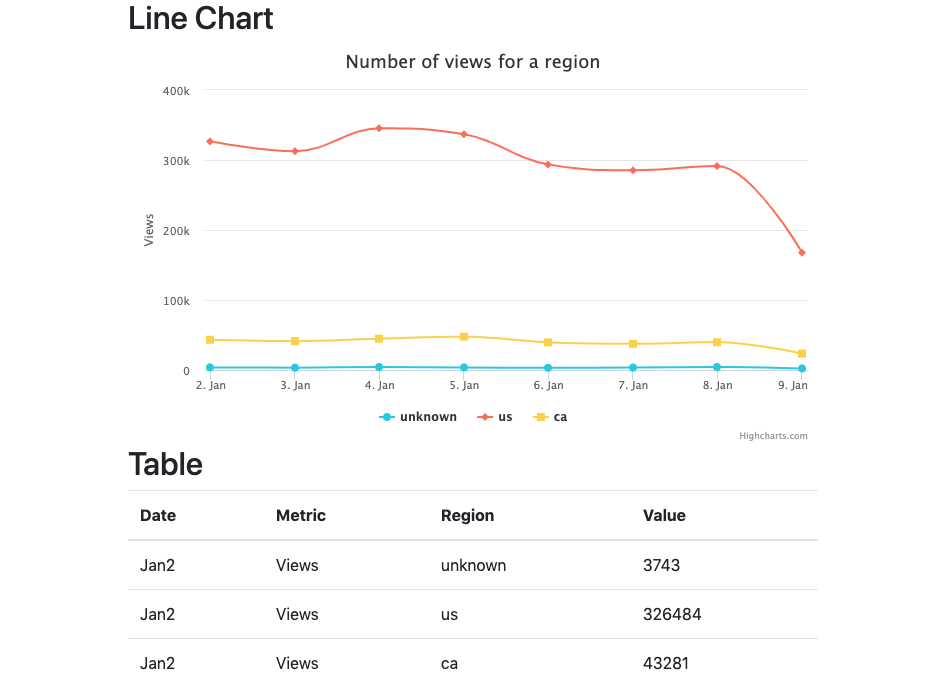
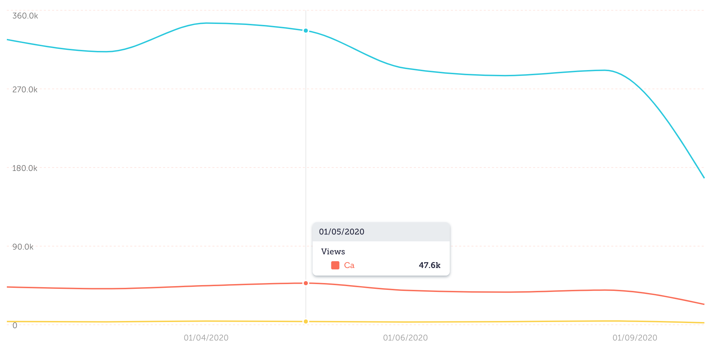

# Pickaxe Foundry Take Home Assignment

This is a take home assignment for the role of web developer / front end engineer at [Pickaxe Foundry](https://pickaxe.ai). The source is tracked in the private GitHub repository [jonrh/pickaxe-assignment](https://github.com/jonrh/pickaxe-assignment). Please get in touch at [hi@jonrh.is]() if you would like access to see the git commit history.

**Author**: Jón Rúnar Helgason  
**Date**: 12. Jan 2020  

The assignment took me about 7 hours excluding breaks. The first 2 hours were spent on getting set up and implementing the table. Next I decided to try out the charting library [recharts](http://recharts.org/). It is one of the charting solution used by Pickaxe. I had never used it before so wanted to give it a go and learn something new. After additonal 2 hours I started running into issues with *recharts* (see notes below) and decided to go instead for Highcharts, something I was more familiar with. It then took me about additional 3 hours to implement unit tests, data transformations and the line chart.

It was a fun assignment which I enjoyed. Plenty of stuff was learned and re-learned. In retrospect going for TypeScript might have been too much for a time limited assignment like this. It would have made more sense had I already been familiar with the types used by React and Highcharts.

## How it looks
[Here is a demo video](demo_video.mp4).  
Below is a screenshot:




## How to run
### In browser at Codesandbox.io
The latest state of this repository is available at [https://codesandbox.io/s/chart-table-55bue]()

### Locally
This is a [Create React App](https://create-react-app.dev/) project. Assuming [Node](https://nodejs.org/) & [yarn](https://yarnpkg.com/) (or [npm](https://www.npmjs.com/)) is installed, run the following in the project directory on the command line:

```
yarn install
yarn run
```

Open a browser at the URL [http://localhost:3000/](http://localhost:3000/)

## Notes

+ I cheated and didn't use codesandbox.io to develop. Instead I created a Git repository and developed locally with my preffered IDE, [WebStorm](https://www.jetbrains.com/webstorm/).

+ The line chart is implemented in [Highcharts](https://www.highcharts.com/). [react-bootstrap](https://react-bootstrap.github.io/) is used to handle responsiveness and the look and feel of the table.

+ When doing data transformations I assume only one element in the `dimensions` and `metrics` arrays. It's not very generic but for the scope of this assignment I valued it as acceptable given the time constraints.

+ Originally I attempted to use *recharts* for the graph. It was the first time I had used it. It looked pretty nice and seemed pretty powerful once you get into the groove of it. The problem I ran into was I couldn't find a built-in way to do a datetime X-axis. Reading the documentation it is supposed to be possible but I couldn't get it to work. I knew Pickaxe was using *recharts* so I looked into the source maps of dashboard.pickaxe.ai and saw some custom utilities that implemented it. After seeing that I abandoned ship and went for Highcharts instead as I knew this was automatically handled which was very beneficial given the time constraints.

+ I originally wrote the `PickaxeChart` component in TypeScript. However I changed over to JavaScript because I ran into an type mismatch of the series data object with Highcharts. I love TypeScript types but didn't really have the time to wrestle the types.

## Development notes

### Highcharts with React
There seem to be two ways to use Highcharts with React these days. 

* Community wrapper, started in 2015  
  https://github.com/kirjs/react-highcharts

* Official React wrapper, started in 2017, maintained by a Highcharts partner  
  https://github.com/highcharts/highcharts-react
  
Both projects seemed to be well maintained. The community one was older and had more GitHub stars. Decided to go with the Official one but for no particular reason really.  

It has been a while since I worked with Highcharts so I used [this](https://jsfiddle.net/gh/get/library/pure/highcharts/highcharts/tree/master/samples/highcharts/demo/spline-irregular-time/) Highcharts example to re-familiarise myself with the options available and the API.


### Recharts resources
* GitHub repository  
  https://github.com/recharts/recharts

* Examplse of a LineChart  
  https://github.com/recharts/recharts/blob/master/demo/component/LineChart.js

* XAxis docs  
  http://recharts.org/en-US/api/XAxis

## Assignment description

Here is a task I'd like you to do by the end of Monday.

- Given the following sandbox https://codesandbox.io/s/chart-table-esiyb - please create a fork 
- Parse/Format data.json in a way that it can be displayed as a chart and as a table (examples below)
- The data contains values for Views for three Regions (Canada, US and Unknown)

Notes:

- don't worry about styling 
- you can use any library you want to create the chart and table
- the tooltip is displayed for each line not for all lines (only the line you click shows its value for that specific point)
- the chart and table are responsive 

Expected results:

### Line Chart (three lines for each region)


### Table (four columns)

Date | Metric | Region | Value  
Jan1 | Views  | ca               | 123  
Jan2 | Views  | us               | 123  
Jan3 | Views  | unknown    | 123  
...  